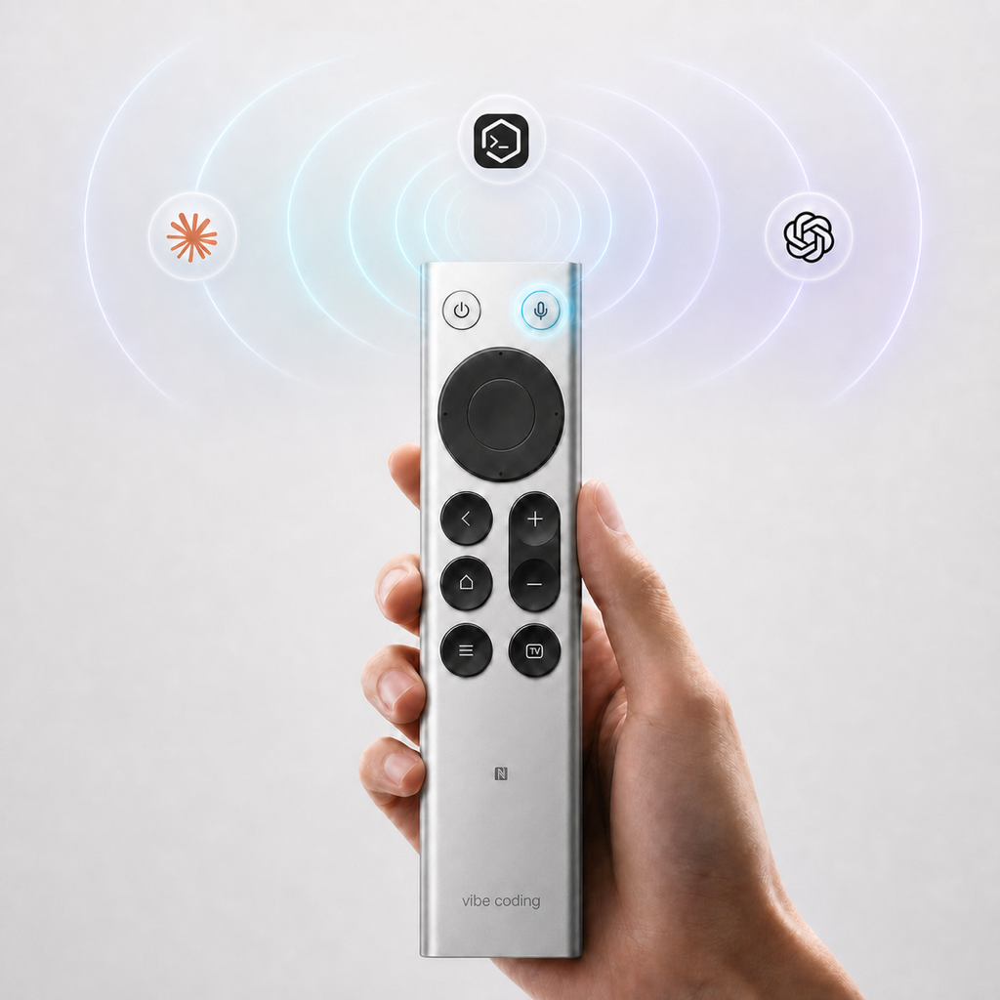

# MiVibe Remote

<p align="center">
  
</p>

<p align="center">
  把小米蓝牙遥控器 2 变成 macOS 和 Windows 上的 Vibe Coding 控制器。
</p>

<p align="center">
  <a href="https://github.com/wyuzhi/MiVibe-Remote/releases/latest">下载安装包</a>
  ·
  <a href="docs/codex-setup.md">Codex 设置</a>
  ·
  <a href="docs/workbuddy-setup.md">WorkBuddy 设置</a>
  ·
  <a href="docs/reference-audit.md">上游复用与技术说明</a>
</p>

## 它能做什么

MiVibe Remote 复用遥控器内置麦克风和实体按键，让你不必一直坐在键盘前：

- 电源键：按当前预设打开或切换到 Codex / WorkBuddy / 微信，也可以改成其他应用；
- 麦克风键：按住开始当前应用的语音输入，松开停止并转写；
- 中间确认键：发送当前输入；
- 返回键：删除光标前的文字；
- 方向键：移动光标或浏览内容；
- 其他普通按键：可以自由映射为快捷键、系统动作、应用启动动作或循环切换预设。

macOS 还支持单击、双击和长按动作；Windows 支持普通单击以及返回键、音量键的长按重复。

## 下载

前往 [GitHub Releases](https://github.com/wyuzhi/MiVibe-Remote/releases/latest) 下载：

- macOS：`MiVibe-Remote-0.1.8.dmg`
- Windows：`MiVibeRemoteSetup-0.1.12.exe`
- 每个安装包旁边都有对应的 `.sha256` 校验文件

> 当前 macOS 首发包使用 ad-hoc 签名，尚未进行 Apple 公证。请只安装本仓库 Release
> 发布的文件。Windows 首发包同样是未进行商业代码签名的候选版本。

## 支持的硬件

- 小米蓝牙遥控器 2（本机 macOS 内部型号显示为 RC001）
- USB Vendor ID：`0x2717`
- USB Product ID：`0x32B8`

使用前先在操作系统蓝牙设置中完成遥控器配对。

## macOS 安装

要求：Apple Silicon Mac、macOS 26 或更高版本。

1. 下载并打开 `MiVibe-Remote-0.1.8.dmg`。
2. 双击“安装 MiVibe Remote.pkg”。
3. 按系统提示输入管理员密码；安装器会同时安装应用和 `MiRemoteV 2ch` 虚拟麦克风。
4. 首次启动后，在“权限”页面依次允许蓝牙、麦克风、输入监控和辅助功能。

关闭设置窗口后，应用仍在后台连接遥控器；点击程序坞中的 MiVibe Remote
即可重新打开设置。需要彻底退出时，使用左侧“退出应用”、`⌘Q` 或程序坞菜单。
5. 在 Codex 中选择 `MiRemoteV 2ch` 作为麦克风。
6. 确认 Codex 的“按住听写”快捷键为 `Control + Shift + D`。

MiVibe Remote 会自动选择正确的虚拟麦克风。正常使用不需要理解或修改“音频路由”。
默认开启“常驻虚拟麦克风”：MiVibe 运行期间系统输入保持为 `MiRemoteV 2ch`；
平时由 MacBook 内置麦克风向它供音，按住遥控器语音键时由遥控器在应用内部
接管，松开后回到 MacBook 麦克风。整个按键过程不再切换系统音频设备，连接
蓝牙耳机也不会把耳机麦克风带入语音链路。退出 MiVibe 后恢复启动前的输入设备，
系统默认输出始终不会被修改。

## Windows 安装

要求：Windows 10/11，首次安装需要联网。

1. 下载并运行 `MiVibeRemoteSetup-0.1.12.exe`。
2. 打开 MiVibe Remote；没有安装语音驱动时，普通按键和设置窗口仍然可以使用。
3. 点击“安装/修复语音驱动”。程序会校验下载文件并打开 VB-Audio 官方安装程序。
4. 在官方窗口点击 `Install`，然后重启 Windows。
5. 在 Codex 中选择 `CABLE Output` 作为麦克风。
6. 确认 Codex 的“按住听写”快捷键为右 Alt。

MiVibe 不会主动修改 Windows 的系统默认麦克风或全局麦克风隐私设置；官方驱动安装期间如果 Windows 自动切换默认设备，助手会尝试恢复安装前的麦克风。

## 默认按键

MiVibe Remote 提供三个一键预设，默认使用 Codex 预设：

| 预设 | 电源键 | 语音键 |
| --- | --- | --- |
| Codex 预设 | 打开/切换到 Codex | macOS 按住 `⌃⇧D`；Windows 按住右 Alt |
| WorkBuddy 预设 | 打开/切换到 WorkBuddy | macOS 在开始/结束时点按 `⌘D`；Windows 点按 `Ctrl+D` |
| 微信预设 | 打开/切换到微信 | macOS 按住 `Fn`；Windows 按住 `Ctrl+Win` |

两套预设的其他按键相同：

| 遥控器按键 | 动作 |
| --- | --- |
| 麦克风 | 按住听写，松开停止 |
| 确定 | Return / 发送 |
| 返回 | Delete / 退格 |
| 方向 | 移动光标 |
| 主页 | 显示桌面 |
| 菜单 | Escape |
| TV | 应用切换 |
| 音量 | 系统音量 |

在“按键”页面点击“Codex 预设”“WorkBuddy 预设”或“微信预设”即可切换；普通按键仍可继续自定义。
也可以把 TV 或其他普通按键设为“循环切换预设”，之后每按一次就按
Codex → WorkBuddy → 微信 → Codex 的顺序切换。切换键会在应用新预设时自动保留；以后增加更多
预设时，会按照预设列表继续向后循环。

## 工作原理

```text
小米遥控器麦克风
  → Bluetooth LE ATVV / IMA ADPCM
  → MiVibe Remote 解码
  → 虚拟麦克风
  → Codex / WorkBuddy / 微信语音输入

小米遥控器实体按键
  → HID 报告
  → MiVibe Remote 映射
  → Codex / WorkBuddy / 微信 / 当前应用
```

本项目不重复实现已经验证的硬件协议：

- macOS 基于 [HD838A/remote-mic-app](https://github.com/HD838A/remote-mic-app) `v1.2.3`；
- Windows 基于 [xxb26553663-star/remote-bridge-hub](https://github.com/xxb26553663-star/remote-bridge-hub) `v1.0.0` 的 Xiaomi 桥；
- [VincentKingHsu/MiRemoteVoice](https://github.com/VincentKingHsu/MiRemoteVoice) `v1.0.0-beta.2` 作为 ATVV 协议实现参考。

精确版本、提交、许可与复用边界见 [UPSTREAM.md](UPSTREAM.md) 和
[docs/reference-audit.md](docs/reference-audit.md)。

## 隐私

- 不上传、保存或转写语音内容；
- 语音只在本机从遥控器传到用户选择的听写应用；
- 日志不记录语音内容、蓝牙地址或外设 UUID；
- macOS 安装器不会修改系统默认输入/输出设备；
- Windows 安装器不会修改系统默认麦克风或全局麦克风隐私设置。

## 从源码构建

本机便携检查：

```bash
./scripts/test-portable.sh
```

macOS：

```bash
cd platforms/macos
./scripts/test.sh
./scripts/build-dmg.sh
./scripts/verify-dmg.sh
```

Windows 请在 Windows PowerShell 中运行：

```powershell
cd platforms/windows
.\delivery\build-standalone-packages.ps1 `
  -Version 0.1.12 `
  -Product xiaomi `
  -AllowUnsignedCandidate
```

根目录的 GitHub Actions 会在原生 macOS 和 Windows runner 上测试并构建两个安装包。

## 许可证

MiVibe Remote 使用 [GPL-3.0-only](LICENSE) 许可证。上游版权、第三方组件许可和未纳入项目的
专有素材说明保留在各平台目录及 `THIRD_PARTY_NOTICES.md` 中。
